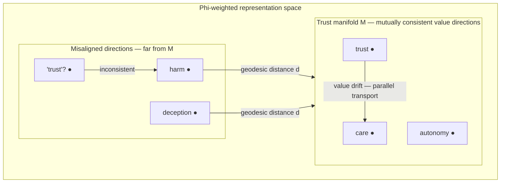
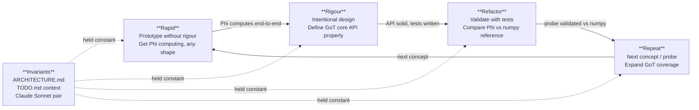
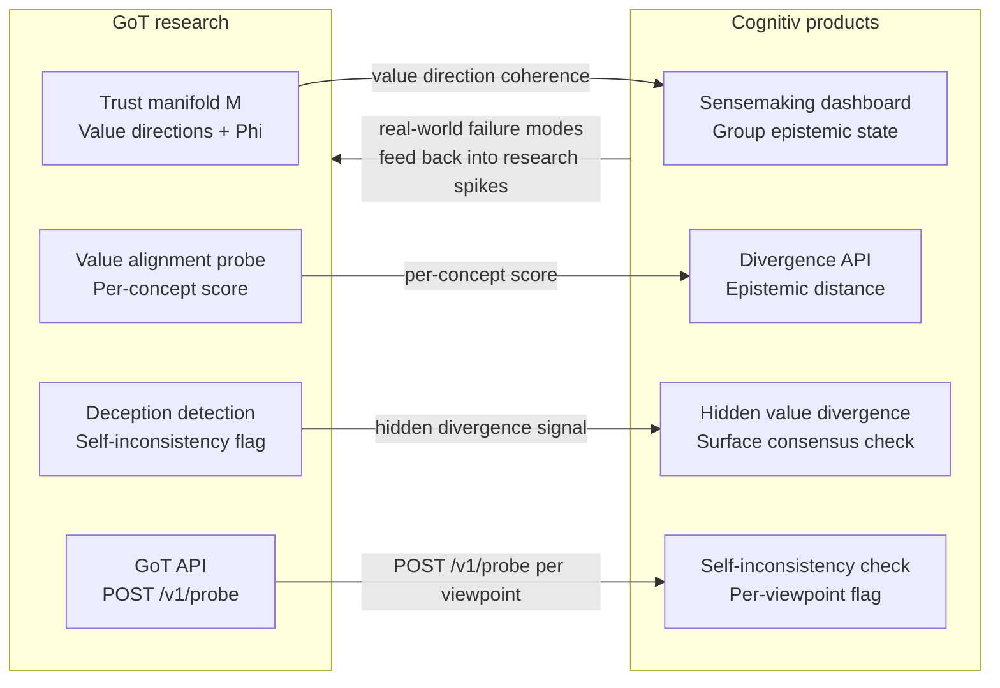

# Architecture Diagrams

Visual references for the key concepts and flows across Synoptic Group. These diagrams are intended for implementers picking up issues cold.

---

## 1. Trust Manifold Geometry

The geometric intuition behind GoT. Aligned value directions (trust, care, autonomy) cluster on or near the trust manifold M with near-zero geodesic distance. Misaligned directions (harm, deception, and a "trust" direction that is actually inconsistent) are scattered far from M and incoherent with each other. The drift arrow shows how value shift during fine-tuning can be modelled as parallel transport along M.

**Key properties:**
- Aligned model: all value directions on or near M, geodesic distance ≈ 0
- Misaligned model: value directions scattered, mutually inconsistent, geodesic distance d > threshold
- Value drift: modelled as parallel transport along M — direction changes but stays on manifold vs. falls off

**Open questions from research doc:**
- Is M locally flat, positively curved, or negatively curved in practice?
- Can we empirically measure parallel transport drift between a base model and its RLHF fine-tune?

---

## 2. Four Rs Applied to GoT Rust PoC

The Four Rs methodology (Rapid → Rigour → Refactor → Repeat) applied specifically to the GoT proof-of-concept development cycle. Each exit condition is defined in terms of the actual GoT work, not generic software milestones. The centre shows what stays constant across iterations.

**How to apply this when picking up a GoT issue:**
1. Start in Rapid — get something running, ignore edge cases
2. Move to Rigour only when the prototype proves the approach works
3. Refactor means validating against the numpy reference implementation, not just "cleaning up"
4. Repeat means the next concept (e.g. add `care` direction after `trust` is validated)

---

## 3. GoT → Cognitiv Integration Points

Maps the four specific points where GoT research feeds into Cognitiv products, and the feedback loop where real-world Cognitiv failures feed back into GoT research spikes. This is the relationship described in `cognitiv-tools.md` under "GoT Integration Point".

**What this means in practice:**
- The sensemaking dashboard can ask: are this group's value directions coherent, or is there hidden divergence masked by surface-level agreement?
- The divergence API can call GoT to flag when a viewpoint claims values it does not reflect in its reasoning (deception signal)
- Cognitiv client sessions will surface failure modes (e.g. GoT probe unreliable for certain text types) that feed directly back into GoT research spikes 2 and 3

---

## Diagram notes

These diagrams use Mermaid syntax and render natively on GitHub. To view locally, use the Mermaid Live Editor at [mermaid.live](https://mermaid.live) or install the Mermaid VS Code extension.
